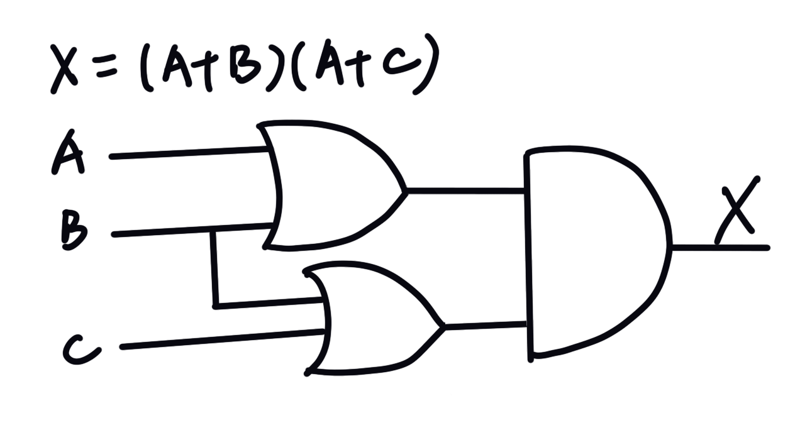
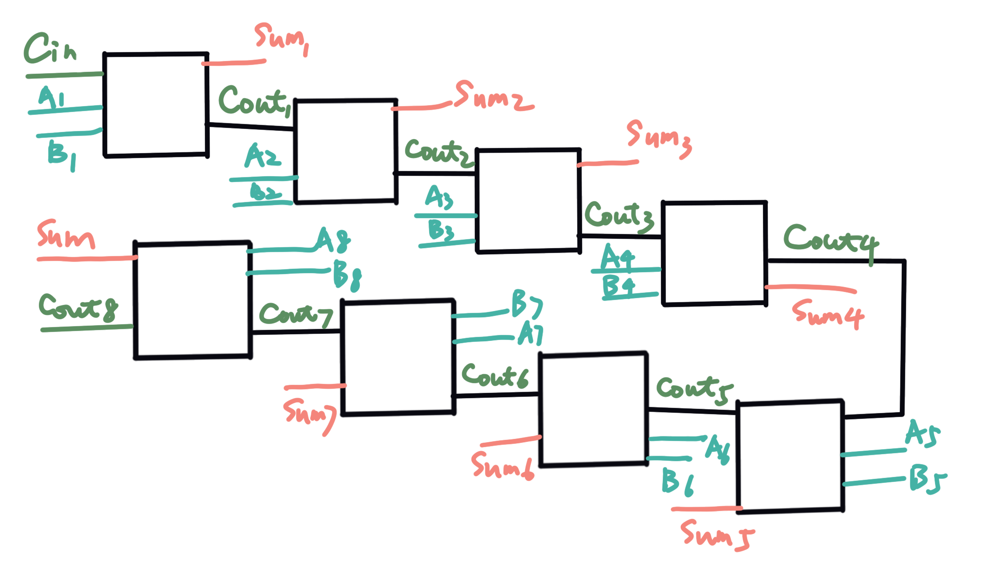

# 第五次作业

## Part 1
1) eg.1: 0 AND 0 = 0; 
    eg.2: 1 AND 0 = 0; 
    eg.3: 1 AND 1 = 1; 
    AND: 全真时为真，否则为假。 
2) eg.1: 0 XOR 0 = 0; 
    eg.2: 1 XOR 0 = 1; 
    eg.3: 1 XOR 1 = 0; 
    XOR: 相异时为真，否则为假。 
3)   
4) (NOTA) XOR (A AND B) 

| A | B | X | 
| ------ | ------ | ------ | 
| 0 | 0 | 1 |
| 0 | 1 | 1 | 
| 1 | 0 | 0 | 
| 1 | 1 | 1 | 

5) 

| A | B | (AB)' | A'+B' |
| ------ | ------ | ------ | ------ | 
| 0 | 0 | 1 | 1 |
| 0 | 1 | 1 | 1 |
| 1 | 0 | 1 | 1 |
| 1 | 1 | 0 | 0 |

6)   

7)  
    (1)$$ (X_8X_7X_6X_51111)_2 $$
    (2)$$ (X_8X_7X_6（X_5）‘（X_4)’（X_3)‘（X_2)’（X_1)‘_2 $$
    (3)$$ (X_8X_7X_6（X_5）‘（X_4)’（X_3)‘（X_2)’（X_1)‘_2 $$

## Part 2
 **使用维基百科，解释以下概念**
* [Logic gate](https://en.wikipedia.org/wiki/Logic_gate) 
In electronics, a logic gate is an idealized or physical device implementing a Boolean function; that is, it performs a logical operation on one or more binary inputs and produces a single binary output. Depending on the context, the term may refer to an ideal logic gate, one that has for instance zero rise time and unlimited fan-out, or it may refer to a non-ideal physical device. 
* [Boolean algebra](https://en.wikipedia.org/wiki/Boolean_algebra) 
In mathematics and mathematical logic, Boolean algebra is the branch of algebra in which the values of the variables are the truth values true and false, usually denoted 1 and 0 respectively. Instead of elementary algebra where the values of the variables are numbers, and the prime operations are addition and multiplication, the main operations of Boolean algebra are the conjunction and denoted as ∧, the disjunction or denoted as ∨, and the negation not denoted as ¬. It is thus a formalism for describing logical relations in the same way that elementary algebra describes numeric relations. 

## Part 3
**自学储存电路。维基百科：“Flip-flop”，选择中文：** 

* Flip-flop的中文翻译是？  
触发器（英语：Flip-flop, FF），中国大陆译作“触发器”、台湾及香港译作“正反器”，是一种具有两种稳态的用于储存的组件，可记录二进制数字信号“1”和“0”。触发器是一种双稳态多谐振荡器（bistable multivibrator）。该电路可以通过一个或多个施加在控制输入端的信号来改变自身的状态，并会有1个或2个输出。触发器是构成时序逻辑电路以及各种复杂数字系统的基本逻辑单元。触发器和锁存器是在计算机、通讯和许多其他类型的系统中使用的数字电子系统的基本组成部分。 
触发器的线路图由逻辑门组合而成，其结构均由SR锁存器派生而来（广义的触发器包括锁存器）。触发器可以处理输入、输出信号和时钟频率之间的相互影响。这里的触发器特指flip-flop，flip-flop一词主要是指具有两个状态相互翻转，例如编程语言中使用flip-flop buffer（翻译作双缓冲）。
 
* How many bits information does a SR latch store? 
一个锁存器可以储存一比特的资讯，通常会有多个一起出现，有些会有特别的名称，像是 “4位锁存器”（可以储存四个比特）或“8位锁存器”（可以储存八个比特）等等。