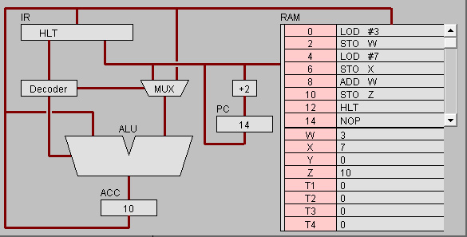
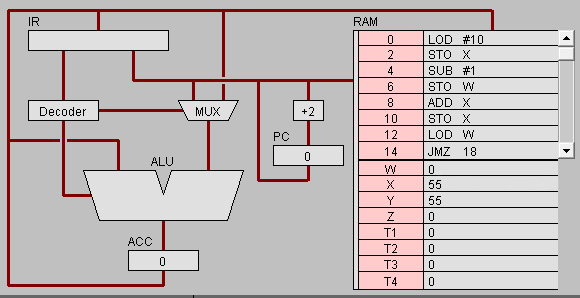

 # 机器语言实验报告

> 实验/学习工具:  简单 CPU 仿真工具 [Pippin CPUSim](http://www.science.smith.edu/~jcardell/Courses/CSC103/CPUsim/cpusim.html) (windows 7 或 以下; 浏览器 IE 8 或 以下)

### [任务1: 简单程序](#1)
### [任务2: 简单循环](#2)
### [实验小结](#3)

<h2 id="1">任务1: 简单程序</h2>

* 打开网页 The PIPPIN User’s Guide ，然后输入 Program 1：Add 2 number

* 点step after step。观察并回答下面问题：

1) PC，IR 寄存器的作用。

>IR的全称是Instructinon register 
指令寄存器是用来存放指令的，存放当前正在执行的指令，包括指令的操作码，地址码，地址信息. 
PC的全称是program counter 
用来存放当前欲执行指令的地址，它与主存的MAR之间有一条直接通路，且具有自加1的功能，即可形成下一条指令的地址。程序计数器是用于存放下一条指令所在单元的地址的地方。 

2) ACC 寄存器的全称与作用。
> 全称:Accumulator(累加器)  
作用:在中央处理器中，累加器 (accumulator) 是一种寄存器，用来储存计算产生的中间结果。

3) 用“LOD #3”指令的执行过程，解释Fetch-Execute周期。
>PC 根据地址从RAM取出指令LOD #3  
指令传入IR，指令传入Decoder，无需取址，数字3传入MUX  
数字3传入ALU之后传入ACC 

4) 用“ADD W” 指令的执行过程，解释Fetch-Execute周期。
>PC根据地址从RAM取出指令ADD W  
指令传入IR之后传入Decoder  
ALU从ACC中取值  
IR再次访问RAM中的W，从W中取值  
W的值读入ALU  
ALU执行加法，结果传入ACC 

5) “LOD #3” 与 “ADD W” 指令的执行在Fetch-Execute周期级别，有什么不同
>LOD #3只需访问RAM一次,而ADD W需要两次访问RAM.  

* 点击“Binary”,观察回答下面问题

1) 写出指令 “LOD #7” 的二进制形式，按指令结构，解释每部分的含义。
>00010100 00000111 
前半部分为命令指示, 后八位为操作数

2) 解释 RAM 的地址。
> 主要用于存储短时间使用的程序, 暂时存放程序和数据, 在断电时将丢失其存储内容。

3) 该机器CPU是几位的？（按累加器的位数）
> 16位

4) 写出该程序对应的 C语言表达。
> int w = 3; int x = 7;  int z = w + x;

<h2 id="2">任务2: 简单循环</h2>

* 输入程序Program 2，运行并回答问题：

1) 用一句话总结程序的功能
> 循环十次，每次x-1, 从x＝10到x=0。

2) 写出对应的 c 语言程序
> int x = 10;  while(x>=0){
    x -= 1;
}

* 修改该程序，用机器语言实现 10+9+8+..1 ，输出结果存放于内存 Y

1) 写出 c 语言的计算过程
> int x = 0;  int w = 0;  while(x>0){ 
 w += x; 
 x -= 1; 
}

2) 写出机器语言的计算过程 
>0000000 00010100 00001010  
0000010 00000101 10000001  
0000100 00010001 00000001  
0000110 00000101 10000000  
0001000 00000000 10000001  
0001010 00000101 10000000  
0001100 00000100 10000000  
0001110 00001101 00010010  
0010000 00001100 00000100  
0010010 00000101 10000010  
0010100 00001111 00000000  
0010110 00001110 00000000  
1000000 00000000  
1000001 00000000  
1000010 00000000  

3) 用自己的语言，简单总结高级语言与机器语言的区别与联系。
> 高级语言面向人类，更便于人类使用理解，而低级语言是给机器使用的，不经过学习的话人类史是无法理解的；同时高级语言经过编译可被“翻译”为低级语言。

>>*[高级语言](https://zh.wikipedia.org/zh-hans/%E9%AB%98%E7%BA%A7%E8%AF%AD%E8%A8%80)与[机器语言](https://zh.wikipedia.org/wiki/%E6%9C%BA%E5%99%A8%E8%AF%AD%E8%A8%80)的主要区别主要体现在执行速度与易读写及易移植方面。* 
*高级编程语言（High-level programming language）是高度封装了的编程语言，与低级语言相对。它是以人类的日常语言为基础的一种编程语言，使用一般人易于接受的文字来表示，有较高的可读性，以方便对计算机认知较浅的人亦可以大概明白其内容。* 
*机器语言（machine language）是一种指令集的体系。这种指令集称为机器代码（machine code），是计算机的CPU可直接解读的数据。*

<h2 id="3">实验小结</h2>

通过本次实验，对汇编语言有了更深的了解，并且认识到了汇编语言与我们常用的高级语言之间的联系与区别，同时学习了一些简单的指令。这一切都使我对计算机的原理等有了更深的理解，受益匪浅。
