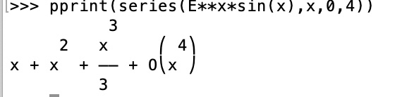

# 10-python 编程实验报告
## [2个高等数学上的作业](#1)
## [2个线性代数上的作业](#2)

学习网站：<br>
[docs.sympy.org](https://docs.sympy.org/latest/tutorial/index.html)<br>
[sympy](https://github.com/sympy/sympy/wiki/Quick-examples)<br>
[The Python Tutorial](https://docs.python.org/3.4/tutorial/)

<h3 id="1"> 选择2个高等数学上的作业，如泰勒分解、公式化简、解方程等。 （一般搜索不到有价值的答案） </h3>

1. 求极限
$$ lim_{x->0} (sin(2x^2)/3x) $$

```python
 from sympy import*
 x = Symbol('x')
 limit((sin(2*x*x))/3*x,x,0)
```
output: 0

2. 在x=0的局部泰勒展开至指定的阶数
$$ e^xsinx  (x^4) $$

```python
from sympy import*
x = Symbol('x')
pprint(series(E**x*sin(x),x,0,4))
```
output: 



<h3 id="2"> 选择2个线性代数上的作业，如求dot、逆矩阵等，最好会解方程。（建议阅读《用Python做科学计算》） </h3>

1. 解方程组

$$ x_1 + 3x_2 - 5x_3 = 4 $$<br>
$$ x_1 + 4x_2 - 8x_3 = 7 $$<br>
$$ -3x_1 - 7x_2 + 9x_3 = -6 $$<br>

```python
import numpy as np 
from sympy import*
x = Symbol('x')
A = np.array([[1,3,-5],[1,4,-8],[-3,-7,9]])
 B = np.array([4,7,-6])
x = np.linalg.solve(A,B)
>>> x
array([-1.,  0., -1.])
>>> np.dot(A,x)
array([ 4.,  7., -6.])
```

2. 求逆矩阵

$$\begin{bmatrix}5 & 10\\\\4 & 7\end{bmatrix}$$

```python
A = np.array([[5,10],[4,7]])
A_det = np.linalg.det(A)
>>> A_det
-4.999999999999999
A_inv = np.linalg.inv(A)
>>> A_inv
array([[-1.4,  2. ],
       [ 0.8, -1. ]])

```
