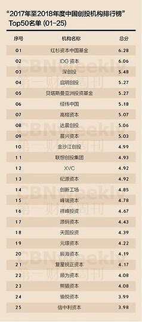

# 14-IT风投之我见

### [什么是“风投”](#1)    
### [IT、风投与中国](#2)

<h2 id="1">什么是“风投”</h2>

>[风险投资：](https://zh.wikipedia.org/wiki/%E9%A3%8E%E9%99%A9%E6%8A%95%E8%B5%84) 
风险投资（英语：Venture Capital，缩写为VC）简称风投，又译称为创业投资，是一种私募股权，一种融资形式，由公司或基金提供给被认为具有高增长潜力或已经表现出高增长的小型早期新兴公司（员工数量，年收入或两者兼而有之）。典型的风险资本投资发生在最初的“种子资金”轮次之后。第一轮为增长提供资金的机构风险资本被称为A轮融资。风险资本家提供此融资是为了通过最终的“退出”事件产生回报，例如公司首次在首次公开募股（IPO）中向公众出售股票或进行并购（也称为作为公司的“贸易销售”）。风险投资公司或基金投资于这些早期阶段的公司，以换取他们投资的公司的股权或所有权股份。风险投资家承担风险，为有风险的初创公司提供融资，希望他们有些公司能够支持将成功。主要是指向初创企业提供资金支持并取得该公司股份的一种融资方式。风险投资是私人股权投资的一种形式。风险投资公司为一专业的投资公司，由一群具有科技及财务相关知识与经验的人所组合而成的，经由直接投资被投资公司股权的方式，提供资金给需要资金者（被投资公司）。风投公司的资金大多用于投资新创事业或是未上市柜企业（虽然现今法规上已大幅放宽资金用途），并不以经营被投资公司为目的，仅是提供资金及专业上的知识与经验，以协助被投资公司获取更大的利润为目的，所以是一追求长期利润的高风险高报酬事业。

<h2 id="2">IT、风投与中国</h2>

上图为2017至2018年度中国创投机构排行榜，图中排名靠前的几个机构，都存在着一些共同点：他们都主要涉及互联网、it产业，如：
>**红杉资本**： 
红杉资本于1972年在美国硅谷成立。在成立之后的30多年之中，红杉作为第一家机构投资人投资了如Apple, Google, Cisco，Oracle, Yahoo, Linkedin等众多创新型的领导潮流的公司。在中国，红杉资本中国团队目前管理约20亿美元的海外基金和近40亿人民币的国内基金，用于投资中国的高成长企业。红杉中国的合伙人及投资团队兼备国际经济发展视野和本土创业企业经验，从2005年9月成立至今，在科技、消费服务业、医疗健康和新能源/清洁技术等投资了众多具有代表意义的高成长公司。 
红杉中国的投资组合包括新浪网、阿里巴巴集团、土巴兔、酒仙网、万学教育、京东商城、文思创新、唯品会、聚美优品、豆瓣网、诺亚财富、高德软件、乐蜂网、奇虎360、乾照光电、焦点科技、大众点评网、美团网[1] 、中国利农集团、乡村基餐饮、斯凯网络、博纳影视、开封药业、秦川机床、快乐购，蒙草抗旱、匹克运动、火币网等。
 
**IDG资本** 
IDG资本已经在中国投资了超过600 家公司，包括腾讯、百度、搜狐、搜房、宜信、小米、携程、金蝶软件、奇虎360、传奇影业、暴风科技等公司，已有超过150 家所投公司公开上市或并购。 
（可以看出，多为IT行业的公司）

显然，不仅仅是以上top2的风投公司把目标投向了IT行业，可以说it产业是目前投资行业的宠儿。

我还在2007年的一则新闻中发现，当时IT行业就已经很被看好，并列出了被看好的几个要素： 
1. 市场要非常大； 
2. 要投的项目一定要有很快的成长速度； 
3. 这个产品最好有很高的毛利润； 
4. 门槛要高，类似的公司不是谁说能开就开的，也就是说没有太多的竞争。  

以上四条，显然，IT行业都是符合的。

我国近些年来在高新技术领域屡有突破，尽管在整体上与国际领先水平仍存在有差距的，但在风投企业的推动下，不仅引入了民间细小资金流的支持，还在某种程度上为行业增加了竞争力，加速了行业发展，好处显而易见。
毫无疑问，在中国，乃至全球未来IT风投都将会取得更大的发展。

