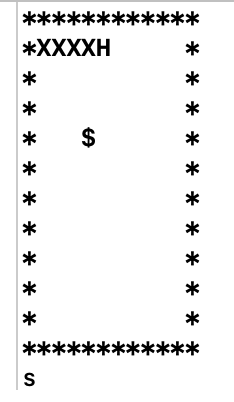

# 13-贪吃蛇实验报告

## [C代码](./code/snake.c)

（位于code文件夹中的snake.c文件）


## 实验报告：

### 一、实验目的<br>

>了解字符游戏的表示<br>
体验自顶向下的设计方法实现问题求解<br>
使用伪代码表示算法<br>
使用函数抽象过程<br>

### 二、游戏要求与表示<br>

1、玩法

贪吃蛇游戏是一款经典的益智游戏，有PC和手机等多平台版本。既简单又耐玩。该游戏通过控制蛇头方向吃蛋，从而使得蛇变得越来越长。百度百科

2、游戏表示

给定一个10*10的字符矩阵表示蛇的生存空间,其中有一条长度5的蛇(HXXXX), “H”表示蛇头,“X”表示蛇身体。空间中可能有食物（“$”表示）和障碍物（“*”表示）

你可以使用“ADWS”按键分别控制蛇的前进方向“左右上下”, 当蛇头碰到自己的身体或走出边界,游戏结束,否则蛇按你指定方向前进一步。

### 三、编程要求

1. **任务1：会动的蛇**

>程序头部要求<br>
定义良好的头部，将使得程序更加易于阅读，易于维护。包括：常数定义、函数定义等。

```c
//
//  main.c
//  snake
//
//  Created by Yqi on 2018/11/29.
//  Copyright © 2018 Pace. All rights reserved.
//

#include <stdio.h>
#include <stdlib.h>
#include <time.h>

#define SNAKE_MAX_LENGTH 20
#define SNAKE_HEAD 'H'
#define SNAKE_BODY 'X'
#define BLANK_CELL ' '
#define SNAKE_FOOD '$'
#define WALL_CELL '*'

//snake stepping: dy = -1(up), 1(down); dx = -1(left), 1(right), 0(no move)
void snakeMove(void);
//put a food randomized on a blank cell
void put_money(void);
//out cells of the grid
void output(void);
//outs when gameover
int gameover(void);

char map[12][12] = {
    "************",       //inatial status
    "*XXXXH     *",
    "*          *",
    "*          *",
    "*          *",
    "*          *",
    "*          *",
    "*          *",
    "*          *",
    "*          *",
    "*          *",
    "************",
};
int snakeLen = 5;
int moneyX;
int moneyY;
int positionX[20] = {1, 1, 1, 1, 1};
int positionY[20] = {5, 4, 3, 2, 1};
```

代码规范<br>
只能使用ANSI C，且不能出现任何warning！！！
即你 不能 使用 getch() 等微软提供的函数
满足 Google c/c++ style
程序结构
程序总体结构必须严格符合以下伪代码框架 

	输出字符矩阵
	WHILE not 游戏结束 DO
		ch＝等待输入
		CASE ch DO
		‘A’:左前进一步，break 
		‘D’:右前进一步，break    
		‘W’:上前进一步，break    
		‘S’:下前进一步，break    
		END CASE
		输出字符矩阵
	END WHILE
	输出 Game Over!!! 
<br>
编程建议（自顶向下，逐步求精）<br>
先按伪代码写好总控（main）代码。
所有函数都是 print 或 简单的语句。 例如： snakeMove 仅需要写几句，输出上下左右即可
逐步完成涉及的函数.

snakeMove:
```c
void snakeMove(void){
    map[positionX[snakeLen - 1]][positionY[snakeLen - 1]] = ' ';
    for (int i = snakeLen - 1; i > 0; i--) {
        positionX[i] = positionX[i - 1];
        positionY[i] = positionY[i - 1];
        map[positionX[i]][positionY[i]] = 'X';
    }
}
```

2. **任务2：会吃的蛇**

功能需求：
snake 头撞到身体、障碍（边界或你在地图中定义） 游戏结束.

gameover:
```c
int gameover(void){
    if (positionY[0]==11 || positionY[0]==0) {
        return 0;
    }
    if (positionX[0]==11 || positionX[0]==0) {
        return 0;
    }
    for (int i = 1; i < snakeLen; i++) {
        if (positionY[0] == positionY[i] && positionX[0] == positionX[i]) {
            return 0;
        }
    }
    return 1;
}
```

snake 头吃到食物，snake就长一节
```c
if(positionX[0] == moneyX && positionY[0] == moneyY){
            put_money();
            snakeLen++;
            positionX[snakeLen - 1] = positionX[snakeLen - 2];
            positionY[snakeLen - 1] = positionY[snakeLen - 2];
            map[positionX[snakeLen - 1]][positionY[snakeLen - 1]] = 'X';
        }
```

细化并完善随机放置食物的伪代码
找一个空白位置
在该位置放置食物
```c
void put_money(void){
    srand((unsigned)(time(NULL)));
    moneyX = rand()%10+1;
    moneyY = rand()%10+1;
    while(map[moneyX][moneyY] != ' '){
        moneyX = rand()%10+1;
        moneyY = rand()%10+1;
    }
    map[moneyX][moneyY] = '$';
}
```

3. **效果展示**


