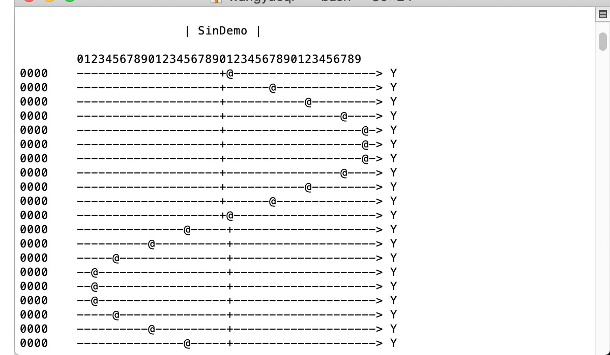
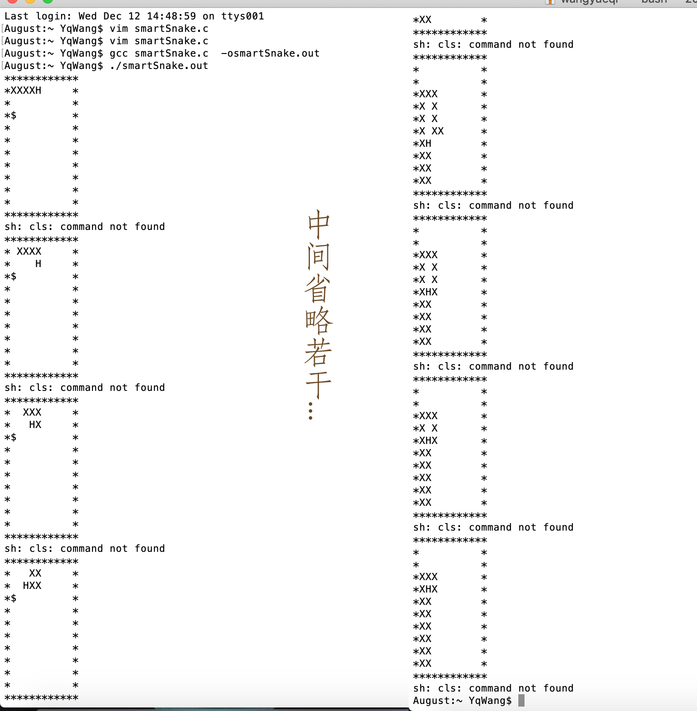

# 14-智能蛇实验报告

*注：由于我的ubuntu有些卡，本篇主要是在macOS Mojave环境下编译，vim和gcc的操作与Ubuntu大致相同。*

本次项目的任务是让蛇有一定的智能，能通过算法具有 “感知 - 决策 - 行动” 的能力。近一步，你可以做出华丽的字符界面，实现 人控蛇 与 智能蛇 抢食大战。

## 一、实验目的

1. 了解 算法 与 “智能” 的关系
2. 通过算法赋予蛇智能
3. 了解 Linux IO 设计的控制

## 二、实验环境

1. Linux Only. 你可以选择 Unbutu、Centos 等发行版。
2. 建议编辑环境 Vim 或 Vscode, 编译 gcc
3. 第一次使用 Linux，建议使用虚拟机。可以使用其他同学准备好的 Vbox 镜像

## 三、控制输入/输出设备

>你知道为什么一行代码要控制在80（字符）列以内？ 原因是 … 原来历史上读程序的卡片机只能读80个字符。当然，超过 80 个字符也打不出来阅读了。<br><br>
那么一个语句超过 80 个字符怎么办？ 续行符…
<br><br>
言归正传，早期的输出设备显示器、打印机，输入设备键盘（打字机）都是80列行缓冲顺序输入和输出设备。即你打印文件时，打印机必须等收到行结束符，打印机才会动作。然而，输入/输出随着应用需求不断进化，字符界面控制与管理已经非常标准化了。

1. VT 100 终端标准

在字符终端上完成“清屏”“修改光标位置”“设置字符前景和背景色”等操作，是通过输出 esc序列实现的。对于 VT100 终端, printf("\033[2J") 就实现了清屏。
<br><br>
详细内容参见， C语言与VT100控制码编程
<br><br>
以下为代码实现效果预览：




sin-demo.c 的代码。（这里仅是转抄，方便你复制）<br>

```c
/******************************************************************
 *                        sinDemo
 *
 *   1. 本Demo主要目标是为了实现在终端下实现sin函数的动态效果;
 *   2. 本Demo之前是使用shell tput和C语言实现的,这次将其改为
 *       C语言+VT100控制码的形式;
 *
 *                              2015-3-27 阴 深圳  曾剑峰
 *
 *****************************************************************/
 #include <stdio.h>
 #include <math.h>
 #include <unistd.h>
 
 /**
  * 定义圆周率的值
  */
 #define PI  3.14
 /**
  * 本Demo中假设sin曲线周期为20,幅值也是20,幅值分正负幅值,
  * 所以后面的很多地方有SIN_AMPLITUDE*2,也就是Y轴方向上的值.
  */
 #define SIN_AMPLITUDE  20      
 /**
  * 定义每次刷新图形时间间隔为100ms
  */
 #define DELAY_TIME  100000  
 /**
  * 定义圆的一周角度为360度
  */
 #define TRIANGLE  360.0   
 /**
  * 输出的时候,数字行放在哪一行,也就是输出图形中的这行数字:
  *   0123456789012345678901234567890123456789
  * 本Demo中把上面这行数字放在界面的第3行
  */
 #define Y_NUMBER_BEGIN_LINE  3
 /**
  * 在本Demo中,图形就在上面数字行的下一行,也就是输出图形中如下面的内容:
  *     0000    --------------------@--------------------> Y
  *     0001                        |-----*             
  *     0002                        |----------*        
  *     0003                        |---------------*   
  *     0004                        |------------------*
  *     0005                        |------------------*
  *     0006                        |------------------*
  *     0007                        |---------------*   
  *     0008                        |----------*        
  *     0009                        |-----*             
  *     0010                        *                   
  *     0011                  *-----|                   
  *     0012             *----------|                   
  *     0013        *---------------|                   
  *     0014     *------------------|                   
  *     0015     *------------------|                   
  *     0016     *------------------|                   
  *     0017        *---------------|                   
  *     0018             *----------|                   
  *     0019                  *-----|                   
  *     0020                        V X  
  */
 #define SIN_GRAPH_BEGIN_LINE (Y_NUMBER_BEGIN_LINE+1)
 
 int main(int argc, char* argv[]){
 
     /**
      * 局部变量说明:
      *     1. i                 : 主要用于循环计算;
      *     2. lineNumber        : 用于保存行号;
      *     3. offsetCenter      : 用于保存sin曲线上的点的相对于中心轴的偏移;
      *     4. nextInitAngle     : 保存下一屏要输出图形的初始角度制角度(如30度);
      *     5. currentInitAngle  : 当前一屏要输出的图形的初始角度制角度(如30度);
      *     6. currentInitradian : 当前一屏要输出的图形的初始弧度制弧度(如PI/6)
      *                            根据currentInitAngle换算而来,因为sin函数需要
      *                            角度制进行求值;
      *
      */
     int    i                   = 0;    
     int    lineNumber          = 0;    
     int    offsetCenter        = 0;    
     int    nextInitAngle       = 0;
     double currentInitAngle    = 0;    
     double currentInitradian   = 0;    
 
     //软件开始运行,清一次屏,保证屏幕上没有无关内容
     printf("\033[2J");
         
     //输出标题,因为这个软件名字叫: SinDemo
     printf("\033[1;1H                       | SinDemo |\t");
 
     /**
      * 这里主要是完成那一行重复的0-9,SIN_AMPLITUDE*2是因为sin曲线的
      * 最高点和最低点是2倍的幅值
      */
     printf("\033[%d;1H\t", Y_NUMBER_BEGIN_LINE);
     for (i = 0; i < SIN_AMPLITUDE*2; i++) 
         printf("%d", i%10);
     printf("\n");
 
     /**
      * while循环主要完成内容:
      *     1. 每次循环对局部变量重新初始化;
      *     2. 将下一屏图形的初始角度赋值给当前的图形初始角;              
      *     3. 将下一屏图形的初始角度加上间隔角度(TRIANGLE/SIN_AMPLITUDE),
      *        TRIANGLE/SIN_AMPLITUDE在本Demo中是360/20=18度,就相当于X轴 
      *        每格代表18度 
      *     2. 调整光标到固定的位置;
      *     3. 重新绘制整屏图形;
      */
     while(1){
 
         //重新初始化局部变量,因为每一屏图形都像一个新的开始
         i                  = 0;        
         offsetCenter       = 0;       
         lineNumber         = 0;      
         currentInitradian  = 0;     
 
         //从nextInitAngle中获取当前的初始化角度
         currentInitAngle   =  nextInitAngle;
 
         //为下一次循环提供下一次的初始化角度
         nextInitAngle     += TRIANGLE/SIN_AMPLITUDE;  
 
         //将光标移动到开始绘图的位置去
         printf("\033[%d;1H", SIN_GRAPH_BEGIN_LINE);
 
         /**
          * 根据不同的情况绘制图形, 每一次循环,就是绘制了图形中的一行
          */
         while(1){
             //判断是不是最后一行,lineNumber起始行是从0开始
             if(lineNumber == SIN_AMPLITUDE){
                 //打印最后一行前面的数字行号
                 printf("\033[%d;1H%04d\t", lineNumber+SIN_GRAPH_BEGIN_LINE, lineNumber);
                 for (i = 0; i < SIN_AMPLITUDE*2; i++)
                     /**
                      * 判断是否到达中间位置,因为中间位置要放V的箭头,同时在旁边输出一个X,
                      * 代表这是X轴方向.
                      */
                     i == SIN_AMPLITUDE ? printf("V X") : printf(" ");    
                 break;
             }
 
 
             /**
              * 对currentInitAngle角度进行修整,比如370度和10度是对应相同的sin值
              * 其实这一步可以不用,但是这里保留了,后面是将currentInitAngle角度制的值
              * 换算成对应的弧度制的值,便于sin求值.
              */
             currentInitAngle = ((int)currentInitAngle)%((int)TRIANGLE);
             currentInitradian = currentInitAngle/(TRIANGLE/2)*PI;    
 
             /**
              * 算出当前次currentInitradian对应的sin值,并乘以幅值SIN_AMPLITUDE,获取sin曲线
              * 在Y轴上相对于中心轴的偏移offsetCenter,offsetCenter可能是正值,也可能是负值,
              * 因为中心轴在中间.
              */
             offsetCenter = (int)(sin(currentInitradian)*SIN_AMPLITUDE);                
 
             /**
              * 在正确的地方输出正确的行号   :)
              */
             printf("\033[%d;1H%04d", lineNumber+SIN_GRAPH_BEGIN_LINE, lineNumber);
 
             //用一个制表符,给出行号与图形的空间距离
             printf("\t");
 
             /**
              * 第一行,和其他的行不一样,有区别,输出结果如下:
              * 0000    ------------@-------+--------------------> Y
              */
             if(lineNumber == 0){
                 for (i = 0; i < SIN_AMPLITUDE*2; i++){
                     /**
                      * 判断当前输出的字符位置是否是X,Y轴交叉的位置,如果是就输出'+',
                      * 不是就输出'-'
                      */
                     i == SIN_AMPLITUDE ? printf("+") : printf("-");
                     /**
                      * 判断当前输出的字符位置是否是sin曲线上的点对应的位置,
                      * 如果是就输出'@'
                      */
                     if(i == offsetCenter+SIN_AMPLITUDE)
                         printf("@");
                 }
                 //代表这个方向是Y轴
                 printf("-> Y\n");
             } else { 
                 for (i = 0; i < SIN_AMPLITUDE*2; i++){
                     //判断当前输出的字符位置是否是sin曲线上的点对应的位置,如果是就输出'*'
                     if(i == (offsetCenter+SIN_AMPLITUDE)){
                         printf("*");
                     //判断当前输出的字符位置是否是X轴上对应的位置,如果是就输出'|'
                     }else if(i == SIN_AMPLITUDE){
                         printf("|");
                     }else{
                         /**
                          * 这里主要是要处理一行里面除了画'*'、'|'、之外的'-'、' '
                          * 其中的SIN_AMPLITUDE到SIN_AMPLITUDE+offsetCenter正好就是需要输出'-'的地方
                          * 其他的地方输出' '
                          */
                         (((i > SIN_AMPLITUDE) && (i < SIN_AMPLITUDE+offsetCenter)) || \
                             ((i < SIN_AMPLITUDE) && (i > SIN_AMPLITUDE+offsetCenter))) \
                                 ? printf("-") : printf(" ");
                     }
                     //行尾,输出换行符
                     if(i == (SIN_AMPLITUDE*2-1)) 
                         printf("\n");
                 }
             }
 
             /**
              * 一行输出完成,为下一行输出作准备,下一行比上一行在角度上多加TRIANGLE/SIN_AMPLITUDE,
              * 在本Demo中相当于360/20=18,也就是加18度.
              */
             currentInitAngle += TRIANGLE/SIN_AMPLITUDE;      
 
             //行号加1
             lineNumber++;                                    
         }
         /**
          * 一屏图像输出完毕,最后输出一个换行符,并且延时一段时间再开始绘制下一屏图形
          */
         printf("\n");
         usleep(DELAY_TIME);
     }
 
     return 0;
 }
```

编译运行它：

```
$ gcc sin-demo.c -osin.out -lm
$ ./sin.out
```

2. 实现 kbhit()

检测 tty 输入的程序，远远超出了入门者的能力，你只需要会运行该程序，并将 snake 代码融入该代码。
<br><br>
以下为下述代码的实现预览：


<br><br>
代码来源: Linux下非阻塞地检测键盘输入的方法 (整理)

```c
#include <stdio.h>
#include <string.h>
#include <sys/time.h>
#include <sys/types.h>
#include <unistd.h>
#include <termios.h>
#include <unistd.h>

static struct termios ori_attr, cur_attr;

static __inline 
int tty_reset(void)
{
        if (tcsetattr(STDIN_FILENO, TCSANOW, &ori_attr) != 0)
                return -1;

        return 0;
}


static __inline
int tty_set(void)
{
        
        if ( tcgetattr(STDIN_FILENO, &ori_attr) )
                return -1;
        
        memcpy(&cur_attr, &ori_attr, sizeof(cur_attr) );
        cur_attr.c_lflag &= ~ICANON;
//        cur_attr.c_lflag |= ECHO;
        cur_attr.c_lflag &= ~ECHO;
        cur_attr.c_cc[VMIN] = 1;
        cur_attr.c_cc[VTIME] = 0;

        if (tcsetattr(STDIN_FILENO, TCSANOW, &cur_attr) != 0)
                return -1;

        return 0;
}

static __inline
int kbhit(void) 
{
                   
        fd_set rfds;
        struct timeval tv;
        int retval;

        /* Watch stdin (fd 0) to see when it has input. */
        FD_ZERO(&rfds);
        FD_SET(0, &rfds);
        /* Wait up to five seconds. */
        tv.tv_sec  = 0;
        tv.tv_usec = 0;

        retval = select(1, &rfds, NULL, NULL, &tv);
        /* Don't rely on the value of tv now! */

        if (retval == -1) {
                perror("select()");
                return 0;
        } else if (retval)
                return 1;
        /* FD_ISSET(0, &rfds) will be true. */
        else
                return 0;
        return 0;
}

//将你的 snake 代码放在这里

int main()
{
        //设置终端进入非缓冲状态
        int tty_set_flag;
        tty_set_flag = tty_set();

        //将你的 snake 代码放在这里
        printf("pressed `q` to quit!\n");
        while(1) {

                if( kbhit() ) {
                        const int key = getchar();
                        printf("%c pressed\n", key);
                        if(key == 'q')
                                break;
                } else {
                       ;// fprintf(stderr, "<no key detected>\n");
                }
        }

        //恢复终端设置
        if(tty_set_flag == 0) 
                tty_reset();
        return 0;
}
```

请先编译运行它：

```
$ gcc tty.c -otty.out
$ ./tty.out
```

四、编写智能算法
编写人工智能程序，使得 snake 每秒自动走一步。

1. 程序要求

请修改初始化字符矩阵，或者通过文件读入地图。地图中有一些你设定的障碍物（墙）
请实现如下算法决定蛇行走的方向
思考：一个长度为5的障碍物能困死该自动跑的蛇吗？
决定蛇行走的方向函数的伪代码

```
    // Hx,Hy: 头的位置
    // Fx,Fy：食物的位置
	function whereGoNext(Hx,Hy,Fx,Fy) {
	// 用数组movable[3]={“a”,”d”,”w”,”s”} 记录可走的方向
	// 用数组distance[3]={0,0,0,0} 记录离食物的距离
	// 分别计算蛇头周边四个位置到食物的距离。H头的位置，F食物位置
	//     例如：假设输入”a” 则distance[0] = |Fx – (Hx-1)| + |Fy – Hy|
	//           如果 Hx-1，Hy 位置不是Blank，则 distance[0] = 9999
	// 选择distance中存最小距离的下标p，注意最小距离不能是9999
	// 返回 movable[p]
	}
```
2. 智能蛇的程序框架

```
	输出字符矩阵
	WHILE not 游戏结束 DO
        wait(time)
		ch＝whereGoNext(Hx,Hy,Fx,Fy)
		CASE ch DO
		‘A’:左前进一步，break 
		‘D’:右前进一步，break    
		‘W’:上前进一步，break    
		‘S’:下前进一步，break    
		END CASE
		输出字符矩阵
	END WHILE
	输出 Game Over!!! 
```

3. 函数设计

*先只实现了自动的功能，其他将继续更新*

```c
#include <stdio.h>
#include <stdlib.h>
#include <time.h>

#define SNAKE_MAX_LENGTH 20
#define SNAKE_HEAD 'H'
#define SNAKE_BODY 'X'
#define BLANK_CELL ' '
#define SNAKE_FOOD '$'
#define WALL_CELL '*'
#define MAP_SIZE 12

int len = 5;
int life = 0;
int food = 0;
int Fx = 0, Fy = 0;//食物坐标
int Hx = 1, Hy = 5;//蛇头坐标
int X[SNAKE_MAX_LENGTH]={1,1,1,1,1};//sanke
int Y[SNAKE_MAX_LENGTH]={1,2,3,4,5};//snake
char map[12][12] =
   {"************",
    "*XXXXH     *",
    "*          *",
    "*          *",
    "*          *",
    "*          *",
    "*          *",
    "*          *",
    "*          *",
    "*          *",
    "*          *",
    "************",};

void snakeMove(int x, int y) {
    int i;
    if ((X[len - 1] - X[len - 2] == -x && Y[len - 1] == Y[len - 2]) || (Y[len - 1] - Y[len - 2] == -y && X[len - 1] == X[len - 2])) {
        return;
    }
    if (map[X[len - 1] + x][Y[len - 1] + y] == WALL_CELL || map[X[len - 1] + x][Y[len - 1] + y] == SNAKE_BODY) {
        life++;
    }
    if (map[X[len - 1] + x][Y[len - 1] + y] == SNAKE_FOOD) {
        map[X[len - 1]][Y[len - 1]] = SNAKE_BODY;
        map[X[len - 1] + x][Y[len - 1] + y] = SNAKE_HEAD;
        len++;
        X[len - 1] = X[len - 2] + x;
        Y[len - 1] = Y[len - 2] + y;
        Hx = X[len - 1];
        Hy = Y[len - 1];
        food--;
    }
    else {
        map[X[0]][Y[0]] = BLANK_CELL;
        for (i = 0; i < len - 1; i++) {
            X[i] = X[i + 1];
            Y[i] = Y[i + 1];
        }
        X[len - 1] += x;
        Y[len - 1] += y;
        Hx = X[len - 1];
        Hy = Y[len - 1];
        map[Hx][Hy] = SNAKE_HEAD;
        for (i = 0; i < len - 1; i++) {
            map[X[i]][Y[i]] = SNAKE_BODY;
        }
    }
    
}
void put_money(void) {
    if (food == 0) {
        srand(time(NULL));
        Fx = rand() % 9 + 1;
        Fy = rand() % 9 + 1;
        if (map[Fx][Fy] == BLANK_CELL) {
            map[Fx][Fy] = SNAKE_FOOD;
            food++;
        }
    }
}
void output(void) {
    int i, j;
    for (i = 0; i < 12; i++) {
        for (j = 0; j < 12; j++)
            printf("%c", map[i][j]);
        printf("\n");
    }
}
void gameover(void) {
    printf ("GAME OVER!!!");
    return;
}
char whereGoNext(int Hx, int Hy, int Fx, int Fy) {
    int i;
    int temp = 0;
    int min = 10000;
    char moveble[4] = "WASD";
    int distance[4]={0, 0, 0, 0};
    distance[0] = abs(Fx - (Hx - 1)) + abs(Fy - Hy);
    distance[1] = abs(Fx - Hx) + abs(Fy - (Hy - 1));
    distance[2] = abs(Fx - (Hx + 1)) + abs(Fy - Hy);
    distance[3] = abs(Fx - Hx) + abs(Fy - (Hy + 1));
    if (map[Hx - 1][Hy] == '*' || map[Hx - 1][Hy] == 'X')
        distance[0] = 9999;
    if (map[Hx][Hy - 1] == '*' || map[Hx][Hy - 1] == 'X')
        distance[1] = 9999;
    if (map[Hx + 1][Hy] == '*' || map[Hx + 1][Hy] == 'X')
        distance[2] = 9999;
    if (map[Hx][Hy + 1] == '*' || map[Hx][Hy + 1] == 'X')
        distance[3] = 9999;
    
    for (i = 0; i < 4; i++) {
        if (min > distance[i]) {
            temp = i;
            min = distance[i];
        }
        else continue;
    }
    return moveble[temp];
}
int main() {
    put_money();
    output();
    while (1) {
        put_money();
        char ch = whereGoNext(Hx, Hy, Fx, Fy);
        switch (ch) {
            case 'A':
                snakeMove(0, -1); break;
            case 'S':
                snakeMove(1, 0); break;
            case 'D':
                snakeMove(0, 1); break;
            case 'W':
                snakeMove(-1, 0); break;
        }
        system("cls");
        if (life != 0) {
            gameover();
            break;
        }
        if (len == 20) {
            printf("you win!!!");
            break;
        }
        output();
    }
}
```

4. 预览


