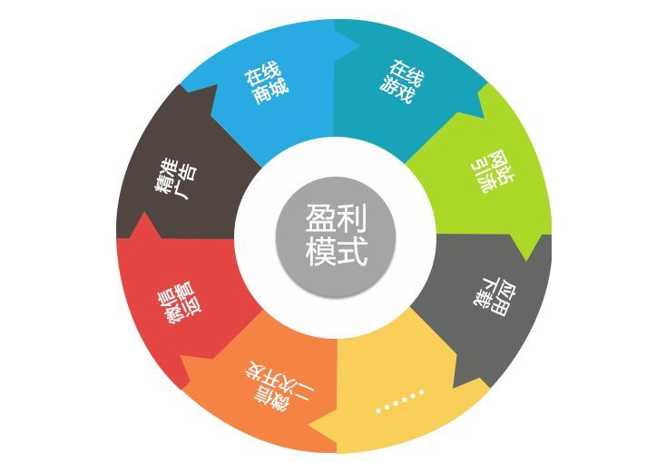

# 15-互联网时代的盈利模式

>**盈利模式**是企业获利的方式，是对不同获利方式的一般性概括和总结。 移动互联网时代的到来迅速改变了游戏规则，以客户关系和价值为基本内容的新的盈利模式将会大行其道。企业关注的重点是如何以更低的成本获取和利用更有效的资源，从而以更快的速度对市场需求做出响应，实现在投入产出比上质的提高。而盈利模式在这样的背景下变得更加复杂而玄幻了。

以下就简单总结一下互联网时代的盈利模式：

## No.1 广告

>**广告**，一种为了某种特定的需要，通过一定形式的媒体，公开而广泛地向公众传递信息的宣传手段。互联网时代，我们常提到的“流量变现”大都是通过广告的形式完成的。  新闻类门户网站大多是这种模式，新浪、搜狐、网易三大门户很大部分盈利是靠广告收入获取的。还有视频类平台也多属这种，如优酷、土豆、腾迅视频，在看视频前都要先看一段广告。

互联网广告模式的产品优点是： 
1. 覆盖面更为广泛；
2. 能承载的广告形式更为丰富；
3. 广告可以精准定向，投放效益更高；

**变现流程**： 互联网产品通过提供廉价甚至免费的服务和平台基础去吸引用户的注入，当具有用户量和平台基础后就具有广告营销的价值，通过为广告主或第三方广告平台提供广告服务赢得丰厚收益。

广告是互联网产品变现的一个重要方式，几乎是最受互联网公司的青睐的一种变现渠道。

## No.2 游戏

游戏产业是一个十分暴利的行业，受众多互联网公司的青睐，如国内的腾讯、完美世界等。

**盈利模式**： 
可简单分为两种： 一种是类似网易《梦幻西游》《魔兽世界》等游戏时长付费形式，按照用户停留游戏时长进行收费； 另一种是类似腾讯的《王者荣耀》《天天酷跑》等增值服务模式，平时玩免费，如果想得到一些特权，需要购买相应的服务。
  
互联网游戏公司有一个共同的特点，通过提供免费的互联网服务积累用户量和流量，然后依托现有的用户流量导入到游戏中，实现盈利。

## No.3 服务（增值服务+普通服务）

>互联网本身就是通过提供服务和功能来为用户产生价值的，有些互联网服务是免费有些是收费的，这就取决于互联网企业愿意采用盈利模式。俗话说：羊毛出在羊身上。互联网企业提供服务，用户享受服务并付出金钱代价，这种方式也是现今最传统最直接的商业逻辑！

**1. 佣金分成** 

互联网产品帮助用户达到某个目的，从而获得佣金分成。互联网产品的佣金模式通常是指平台类产品为企业销售的实现提供帮助而获得报酬。常见的有电商类平台和团购类平台

**盈利模式**： 提供平台让商家入驻，为其引流，收取佣金。
 
代表企业：美团点评、猫眼电影、淘宝、京东...
  
**2.产业链支持服务**  

相当多的技术驱动型的互联网公司都具有自己独特的技术和资源，将自身的技术和资源打包提供给用户使用，收取使用费。常见的服务有：云服务、数据服务、地图服务、开发API、流量服务等。

**盈利模式**： 提供资源和功能服务，收取使用费和服务费。 
代表企业： 金山云、阿里巴巴、百度、高德地图、腾讯...

**3.增值服务**  

根据客户需要，为客户提供的超出常规服务范围的服务，或者采用超出常规的服务方法提供的服务。这方面腾讯做得非常好，一系列的产品：QQ会员，QQ秀，QQ各种钻等在中国互联网发展历史中，留下了一页一页非常重要的印记。

**盈利模式**: 
在互联网行业中增值服务更多的是一种差异化的服务，用户通过付费实现普通用户无法实现的一些功能，享受到更加高级个性化的服务体验！

## No.4 电商

电商将整个贸易过程中各阶段贸易活动电子化。电商平台或提供平台供广大商家销售产品，或自有商品，通过线上优势挣取差价。

**盈利模式**： 1.提供平台供其它人开店，然后收取佣金（阿里巴巴）。2.省却线下成本，以优秀的运营管理，让它们能给出优于实体店的商品价格，通过成本控制，实现盈利（京东）3.通过营销活动向生产厂商收取推介费用等。 
代表产品： 天猫、淘宝、京东...

## 总结

>互联网的盈利模式看似纷繁复杂，其实却是有迹可循。针对不同的对象，产生了不同的商业模式。宏观上看也就分为：面向用户盈利；面向第三方；面向企业。
另附一张知乎大神总结的盈利模式图，以供参考：

### 参考文章： 

[互联网人不得不知的盈利模式
](https://zhuanlan.zhihu.com/p/25877628) 
[互联网产品的各种盈利模式](https://www.jianshu.com/p/12535e871d17) 
[互联网盈利模式浅析](https://www.jianshu.com/p/9475510fdc26)