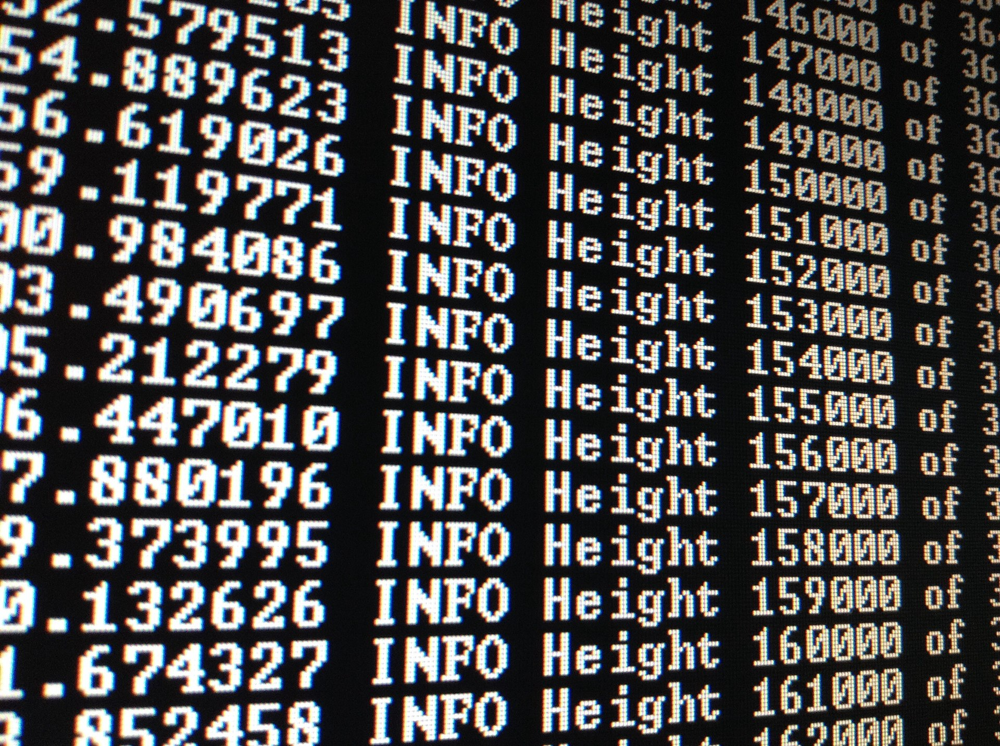

# 16-互联网时代的热点领域选择、营销方法

## [互联网时代的热点领域](#1)
## [互联网时代的营销方法](#2)

<h2 id="1">互联网时代的热点领域</h2>

### [人工智能](https://zh.wikipedia.org/wiki/%E4%BA%BA%E5%B7%A5%E6%99%BA%E8%83%BD)

**2017年12月，人工智能入选“2017年度中国媒体十大流行语”。** 
毫无疑问，人工智能已经成为当前互联网时代最具有代表性的热点话题。

>**人工智能**（英语：Artificial Intelligence，缩写为 AI）亦称机器智能，指由人制造出来的机器所表现出来的智能。通常人工智能是指通过普通计算机程序的手段实现的人类智能技术。该词也指出研究这样的智能系统是否能够实现，以及如何实现。同时，人类的无数职业也逐渐被其取代。 
 

### [大数据](https://zh.wikipedia.org/wiki/%E5%A4%A7%E6%95%B8%E6%93%9A)

**“大数据”时代已经降临。**
——《纽约时报》

>**大数据**（英语：Big data），又称为巨量资料，指的是传统数据处理应用软件不足以处理它们的大或复杂的数据集的术语[4][5]。大数据也可以定义为来自各种来源的大量非结构化或结构化数据。从学术角度而言，大数据的出现促成了广泛主题的新颖研究。这也导致了各种大数据统计方法的发展。大数据并没有抽样;它只是观察和追踪发生的事情。因此，大数据通常包含的数据大小超出了传统软件在可接受的时间内处理的能力。由于近期的技术进步，发布新数据的便捷性以及全球大多数政府对高透明度的要求，大数据分析在现代研究中越来越突出。

>最早提出**大数据时代**到来的是全球知名咨询公司麦肯锡，麦肯锡称：“数据，已经渗透到当今每一个行业和业务职能领域，成为重要的生产因素。人们对于海量数据的挖掘和运用，预示着新一波生产率增长和消费者盈余浪潮的到来。” “大数据”在物理学、生物学、环境生态学等领域以及军事、金融、通讯等行业存在已有时日，却因为近年来互联网和信息行业的发展而引起人们关注。

>进入2012年，大数据（big data）一词越来越多地被提及，人们用它来描述和定义信息爆炸时代产生的海量数据，并命名与之相关的技术发展与创新。它已经上过《纽约时报》《华尔街日报》的专栏封面，进入美国白宫官网的新闻，现身在国内一些互联网主题的讲座沙龙中，甚至被嗅觉灵敏的国金证券、国泰君安、银河证券等写进了投资推荐报告。  
数据正在迅速膨胀并变大，它决定着企业的未来发展，虽然很多企业可能并没有意识到数据爆炸性增长带来问题的隐患，但是随着时间的推移，人们将越来越多的意识到数据对企业的重要性。 
正如《纽约时报》2012年2月的一篇专栏中所称，“大数据”时代已经降临，在商业、经济及其他领域中，决策将日益基于数据和分析而作出，而并非基于经验和直觉。 
哈佛大学社会学教授加里·金说：“**这是一场革命**，庞大的数据资源使得各个领域开始了量化进程，无论学术界、商界还是政府，所有领域都将开始这种进程。” 
 

### [自媒体](https://zh.wikipedia.org/wiki/%E8%87%AA%E5%AA%92%E4%BD%93)

如今，我们生活中的大多数信息来源已渐渐被自媒体所取代。你常浏览的咨询公众号或是美妆博主微博等等，都是自媒体时代的典型例子。

>**自媒体**（英语：self-media或英语：we media），互联网术语，“公民媒体”或“个人媒体”，是指私人化、平民化、普泛化、自主化的传播者以现代化、电子化的手段，向不特定的大多数或者特定的单个人传递规范性及非规范性信息的新媒体的总称。意指在网络技术；特别是Web2.0的环境下，由于博客、微博、共享协作平台、社交网络的兴起，使每个人都具有媒体、传媒的功能。
 
有人认为因为自媒体发表容易，所以称为草根媒体，但实际上的草根层次结构较接受的是和自媒体相对的大众媒体。自媒体也是相对传统新闻方式的表述，即：具有传统媒体功能却不具有传统媒体运作架构的个人网络行为。 
 

### [区块链](https://zh.wikipedia.org/wiki/%E5%8C%BA%E5%9D%97%E9%93%BE)

>**区块链**（英语：blockchain或block chain）是借由密码学串接并保护内容的串连交易记录（又称区块）。每一个区块包含了前一个区块的加密散列、相应时间戳记以及交易数据（通常用默克尔树算法计算的散列值表示），这样的设计使得区块内容具有难以篡改的特性。用区块链所串接的分布式账本能让两方有效纪录交易，且可永久查验此交易。
 
中本聪在2008年，于《比特币白皮书》中提出“区块链”概念，并在2009年创立了比特币网络，开发出第一个区块，即“创世区块”。 
 

<h2 id="2">互联网时代的营销方法</h2>

### [饥饿营销](https://baike.baidu.com/item/%E9%A5%A5%E9%A5%BF%E8%90%A5%E9%94%80)

>“饥饿营销”，运用于商品或服务的商业推广，是指商品提供者有意调低产量，以期达到调控供求关系、制造供不应求“假象”、以维护产品形象并维持商品较高售价和利润率的营销策略。
 

### [口碑营销](https://baike.baidu.com/item/%E5%8F%A3%E7%A2%91%E8%90%A5%E9%94%80/3918553)

>菲利普▪科特勒将21世纪的口碑传播定义为：由生产者以外的个人通过明示或暗示的方法，不经过第三方处理、加工，传递关于某一特定或某一种类的产品、品牌、厂商、销售者，以及能够使人联想到上述对象的任何组织或个人信息，从而导致受众获得信息、改变态度，甚至影响购买行为的一种双向互动传播行为。 
口碑营销是企业在调查市场需求的情况下，为消费者提供他们所需要的产品和服务，同时制定一定口碑推广计划，让消费者自动传播公司的产品和服务的良好评价，让人们通过口碑了解产品、树立品牌，最终达到企业销售产品和提供服务的目的。
 

### [病毒营销](https://baike.baidu.com/item/%E7%97%85%E6%AF%92%E8%90%A5%E9%94%80)

>病毒营销（Viral Marketing，又称病毒式营销、病毒性营销、基因营销或核爆式营销），是利用公众的积极性和人际网络，让营销信息像病毒一样传播和扩散，营销信息被快速复制传向数以万计、数以百万计的观众，它能够像病毒一样深入人脑，快速复制，迅速传播，将信息短时间内传向更多的受众。病毒营销是一种常见的网络营销方法，常用于进行网站推广、品牌推广等。 
也就是说，病毒营销是通过提供有价值的产品或服务，“让大家告诉大家”，通过别人为你宣传，实现“营销杠杆”的作用。病毒式营销已经成为网络营销最为独特的手段，被越来越多的商家和网站成功利用。 
病毒式营销也可以称为是口碑营销的一种，它是利用群体之间的传播，从而让人们建立起对服务和产品的了解，达到宣传的目的。 
由于这种传播是用户之间自发进行的，因此是几乎不需要费用的网络营销手段。 

### [跨界营销](https://baike.baidu.com/item/%E8%B7%A8%E7%95%8C%E8%90%A5%E9%94%80)

>跨界营销是一种营销方式。“跨界”代表一种新锐的生活态度与审美方式的融合。跨界合作对于品牌的最大益处，是让原本毫不相干的元素，相互渗透相互融合，从而给品牌一种立体感和纵深感。 
可以建立“跨界”关系的不同品牌，一定是互补性而非竞争性品牌。这里所说的互补，并非功能上的互补，而是用户体验上的互补。